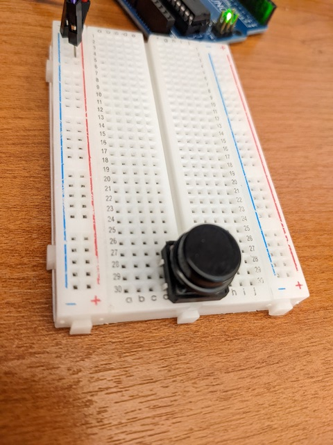
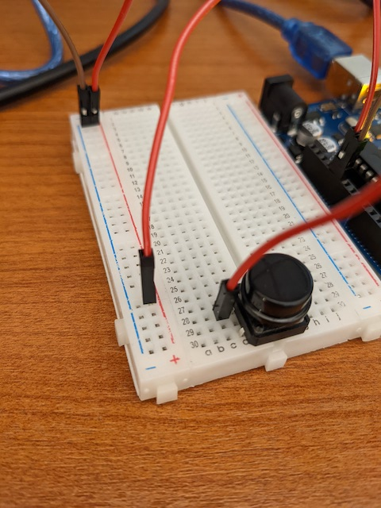
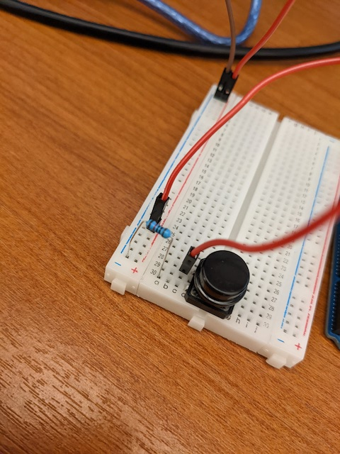
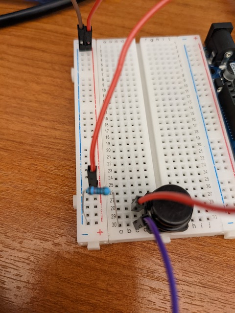
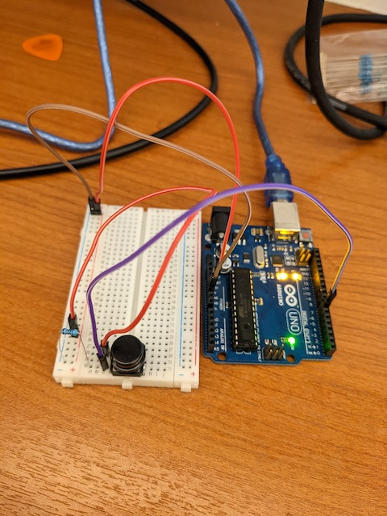
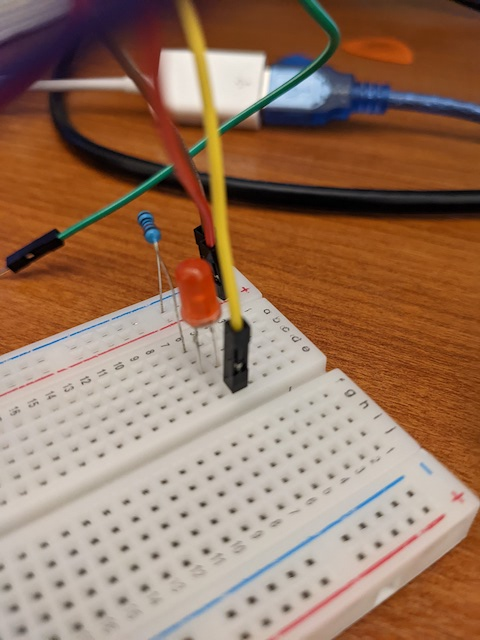
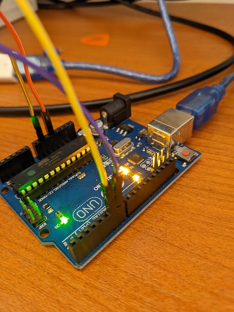
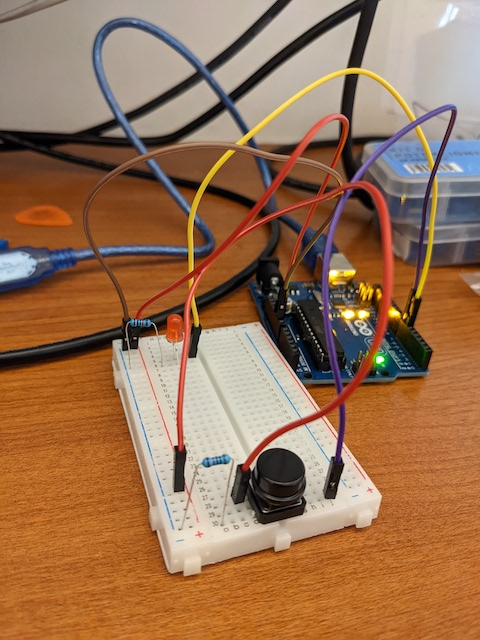

# clase-04

viernes 14 abril 2023, presencial

## repaso clase anterior y programa hoy (10 min)

la clase pasada aprendimos:

- fundamentos de programación en Arduino
- comunicación serial entre Arduino y computador

hoy aprenderemos:

- botón pulsador
- delay() y maneras de evitarlo
- potenciómetro
- PWM

## repaso botón pulsador (60 min)

repasemos cómo conectar un botón pulsador como entrada digital al microcontrolador Arduino.

este es un pulsador.

lo conectamos al extremo inferior de la protoboard, con pins repartidos entre columnas d y g.

esta es la vista desde la izquierda.

esta es la vista desde la derecha.

después conectamos cables a los pins 5V y GND de nuestro Arduino, convención es colores rojo o naranjo para voltaje de alimentación (5V) y colores café o negro para tierra (GND).

conectamos los otros extremos de los cables a los rieles de alimentación izquierdos de la protoboard. 5V desde Arduino se conecta a + rojo, y GND de Arduino se conecta a - azul.

hasta el momento el pulsador está solamente conectado mecánicamente a la protoboard, pero no tiene conexiones eléctricas.

conectemos su pin superior a 5V con un cable rojo.

un circuito por donde circula corriente necesita de un camino entre los terminales de la fuente de poder, en nuestro caso los pins 5V y GND de Arduino.

queremos entonces conectar el otro pin del botón a tierra GND, pero no podemos hacer una conexión directamente con un cable, ya que eso haría un cortocircuito o conexión directa entre los terminales 5V y GND.

en vez de un cable, usamos un resistor para conectar el pin inferior a tierra.

podemos leer el voltaje en los pines superior e inferior del pulsador, para obtener información digital, donde 1 es 5V y 0 es GND, en lógica digital.

el pin superior está conectado directamente a 5V, por lo que no aporta información, siempre es 1.

el pin inferior es el que alterna entre estados. está en 0 cuando no está pulsado, y cambia a 1 cuando está pulsado, por lo que conectamos un cable a esta fila en la protoboard.

el otro extremo del cable lo conectamos a la sección digital de Arduino, para este ejemplo al pin 7.

esta es la vista final del circuito.

subamos el código de [ej_00_lectura_pulsador](./ej_00_lectura_pulsador/) de lectura de pulsador a nuestro Arduino.

expliquemos con ley de Ohm la razón por la que el pin inferior alterna entre voltajes.

la ley de Ohm postula que ΔV = I \* R, lo que se puede interpretar así:

- R = ΔV / I: resistencia R es la constante de proporcionalidad directa entre diferencia de voltaje ΔV y corriente I.
- cuando no hay corriente (I = 0) a través de una resistencia R, no hay caída de voltaje en una resistencia (ΔV = 0), por lo que ambos terminales tienen el mismo voltaje.

cuando el pulsador NO ESTÁ PRESIONADO, no puede circular corriente (I = 0) a través de la resistencia R, por lo que no hay diferencia de voltaje (ΔV = 0) entre los terminales de la resistencia R, por lo que ambos comparten voltaje. Como Arduino hace que un terminal sea GND (V = 0), el otro también es 0, y eso es lo que lee Arduino.

cuando el pulsador SÍ ESTÁ PRESIONADO, se convierte en un cable, que conecta 5V la resistencia y al pin de lectura de Arduino, y ese voltaje cae a GND a través de la resistencia, circulando corriente y disipando energía.

## pulsador y luz (60 min)

agregaremos a nuestro circuito un LED que pueda ser encendido o apagado según el pulsador.

seguiremos la convención de orientar terminales positivos arriba y terminales positivos abajo.

nuestro LED estará en la columna c de la protoboard, con el pin positivo en el terminal c5 y el pin positivo en el terminal c6. recordatorio: pin negativo (-) es el que tiene el lado plano.

conectamos una resistencia entre tierra y la fila 6 para así conectar el pin negativo del LED a tierra a través de una resistencia, como lo hicimos con el pulsador.

si conectamos el pin positivo del LED a 5V directamente, estará prendido sin interrupciones.

como queremos controlar el encendido y apagado del LED con el pulsador, conectaremos un cable a la fila 5 para conectarlo a un pin digital del microcontrolador Arduino.

usamos el pin 6 digital que está definido vía software como una salida digital, permitiendo así programar salidas de 5V o tierra para encender o apagar el LED respectivamente.

así se ve el circuito completo.

para probar este funcionamiento, subimos el código del ejemplo [ej_01_pulsador_luz](./ej_01_pulsador_luz/).

## ejemplos de luz intermitente (30 min)

usando el mismo circuito veremos 2 aproximaciones distintas a crear una luz intermitente.

en ambos, cuando el pulsador no está presionado, la luz está apagada, y cuando el pulsador sí está presionado, la luz alterna entre prendida y apagada de forma intermitente.

para la primera usaremos el ejemplo [ej_02_pulsador_luz_intermitente_delay/](./ej_02_pulsador_luz_intermitente_delay/), donde usamos la función delay() de Arduino para lograr la intermitencia.

la función delay() introduce problemas de interacción, ya que mientras está corriendo esta función, Arduino no es capaz de leer ni escribir en sus otros pins.

por esto creamos el ejemplo [ej_03_pulsador_luz_intermitente/](./ej_03_pulsador_luz_intermitente/), que es más complejo, y usa funciones de contador de milisegundos para detectar tiempo transcurrido, sin pausar el funcionamiento de Arduino al no usar funciones delay().

## ejemplos de potenciometro (30 min)

usaremos un potenciómetro de precisión, que posee 3 pines.

los pines de los extremos son conectados a poder (5V y tierra) y el del medio se usa como sensor de la perilla.

se recomienda esta manera de ubicarlo en protoboard para tener más espacio para operar su perilla.

al hacer girar la perilla en el sentido del reloj, el valor disminuye.

el ejemplo [ej_04_potenciometro/](./ej_04_potenciometro/) que usaremos incluye las instrucciones como comentarios.

los ejemplos [ej_05_perilla_min_max](./ej_05_perilla_min_max/) y [ej_06_perilla_mapeo](./ej_06_perilla_mapeo/) muestran maneras de detectar valores mínimo y máximo de forma automática y mapear a otro rango de operación.

el último ejemplo [ej_07_perilla_brillo_led/](./ej_07_perilla_brillo_led/) permite cambiar brillo del LED con una salida PWM, que será la base de los ejemplos de sonido de la próxima semana.

## repaso clase anterior y programa hoy

la clase pasada aprendimos:

- señales analógicas y digitales
- computadores y microcontroladores
- programar semáforo usando Processing
- instalación de software para el curso

hoy aprenderemos:

- electricidad y magnetismo
- componentes eléctricos
- circuitos eléctricos

## fuentes de poder

estas son las características que tienen:

- entrada: voltaje (V) y corriente (A), tipo DC o AC
- salida: voltaje (V) y corriente (A), tipo DC o AC
- conectores físicos

## electricidad y magnetismo

- [electrón](https://es.wikipedia.org/wiki/Electr%C3%B3n): partícula subatómica con una carga negativa.

- [electromagnetismo](https://es.wikipedia.org/wiki/Electromagnetismo): interacción de partículas cargadas con campos eléctricos y magnéticos.

- [4 ecuaciones de Maxwell](https://es.wikipedia.org/wiki/Ecuaciones_de_Maxwell)

- [voltaje](<https://es.wikipedia.org/wiki/Tensi%C3%B3n_(electricidad)>): Su unidad es Volt (V).

- [corriente](https://es.wikipedia.org/wiki/Corriente_el%C3%A9ctrica): su unidad es Ampère (A).

- [resistencia](https://es.wikipedia.org/wiki/Resistencia_el%C3%A9ctrica): oposición al flujo de corriente eléctrica. Su unidad es Ohm (Ω).

- [potencia](https://es.wikipedia.org/wiki/Potencia_el%C3%A9ctrica): energía consumida en un periodo de tiempo. Su unidad es Watt (W).

- [ley de Ohm](https://es.wikipedia.org/wiki/Ley_de_Ohm): V = I \* R

## componentes eléctricos (30 minutos)

- [resistor](https://es.wikipedia.org/wiki/Resistor): componente de 2 terminales que se puede conectar entre dos terminales de un circuito eléctrico para oponer resistencia al paso de corriente.

- [potenciómetro](https://es.wikipedia.org/wiki/Potenci%C3%B3metro): componente de 3 terminales, de resistencia variable. la resistencia entre los terminales extremos es fija, y entre cualquier extremo y el centro es variable según su posición mecánica.

- [botón](<https://es.wikipedia.org/wiki/Bot%C3%B3n_(dispositivo)>): componente de 2 terminales, permite

- [LED](https://es.wikipedia.org/wiki/Led): diodo emisor de luz. un diodo es un componente de 2 terminales que permite solamente el flujo de corriente en una dirección. sus terminales son llamados ánodo (positivo) y cátodo (positivo). nemotecnia: vistos desde arriba no son redondos, sino que tienen un lado plano, este es el lado negativo (-).

- [placa de pruebas](https://es.wikipedia.org/wiki/Placa_de_pruebas): tablero con orificios que se encuentran conectado eléctricamente de manera interna. sirve como soporte físico y de prototipado de circuitos.

## electrónica

la ingeniería eléctrica clásica usa efectos pasivos, como resistencia, capacitancia e inductancia para controlar el flujo de corriente eléctrica.

la electrónica usa dispositivos activos para controlar el flujo de electrones, logrando efectos como amplificación y rectificación.

la electrónica puede ser análoga o digital.
