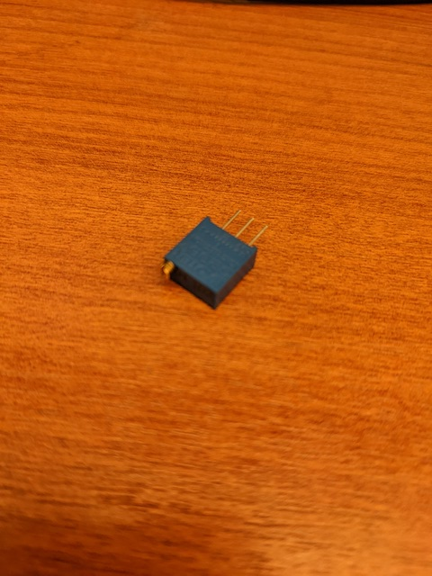
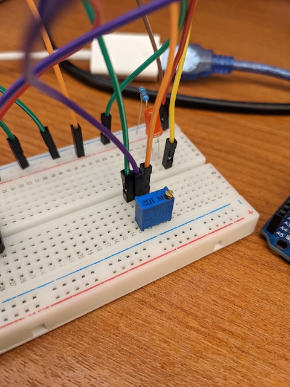

# clase-05

viernes 21 abril 2023, presencial

## ejemplos de potenciometro (30 min)

usaremos un potenciómetro de precisión, que posee 3 pines.

los pines de los extremos son conectados a poder (5V y tierra) y el del medio se usa como sensor de la perilla.

se recomienda esta manera de ubicarlo en protoboard para tener más espacio para operar su perilla.

al hacer girar la perilla en el sentido del reloj, el valor disminuye.

el ejemplo [ej_04_potenciometro/](./ej_04_potenciometro/) que usaremos incluye las instrucciones como comentarios.

los ejemplos [ej_05_perilla_min_max](./ej_05_perilla_min_max/) y [ej_06_perilla_mapeo](./ej_06_perilla_mapeo/) muestran maneras de detectar valores mínimo y máximo de forma automática y mapear a otro rango de operación.

el último ejemplo [ej_07_perilla_brillo_led/](./ej_07_perilla_brillo_led/) permite cambiar brillo del LED con una salida PWM, que será la base de los ejemplos de sonido de la próxima semana.

agregar LED RGB
agregar LED RG + PULSADOR
