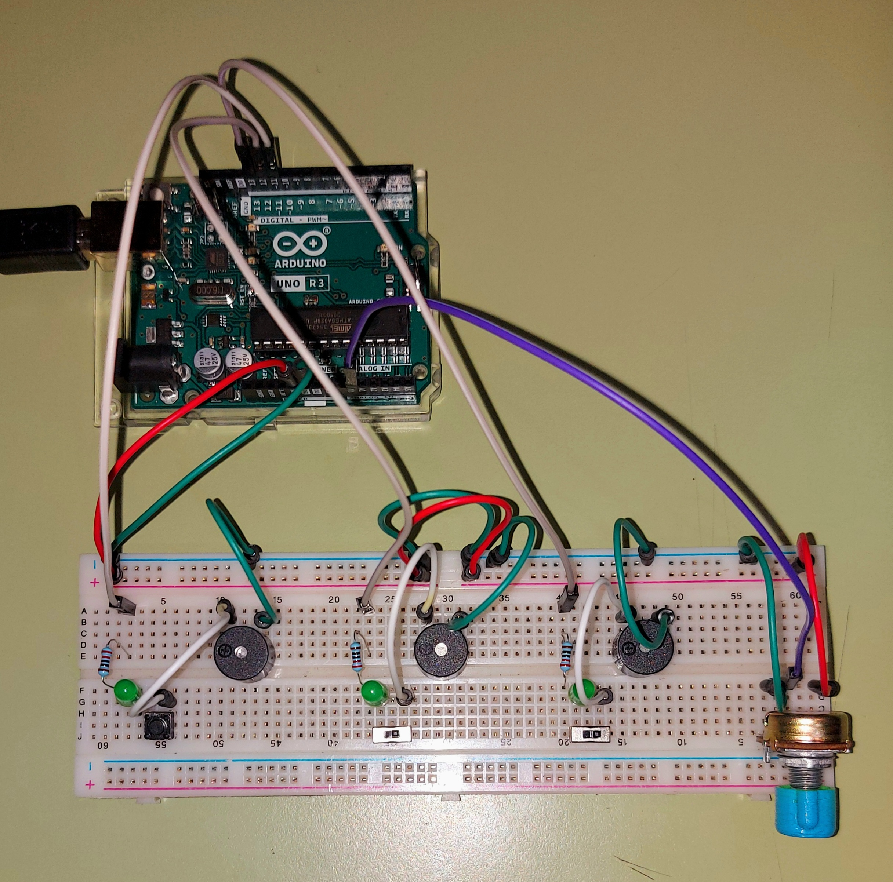

# Arpegiador de 3 voces

por Amanda Iriarte y Andrés Martin

## puntos

### punto base :white_check_mark:

### asistencia :white_check_mark:

### materiales

- Arduino UNO[R3]
- Protoboard 60 filas
- 3 Buzzer
- 3 LEDs
- 3 Resistores (220 Ω)
- Potenciometro (10K Ω)
- 2 Switch
- Boton pulsador
- Muchos cables dupont (16)
- Cable USB

### circuito

El potenciometro va conectado a una entrada análoga (A0, además de a 5V y GND) para regular la frecuencia desde el código. Hay 3 'modulos' de audio compuestos por un resistor, un LED, un interruptor (uno pulsador y 2 switch) y un buzzer (en ese orden), cada uno de estos módulos está conectado a una salida digital al principio y a GND al final.

### código

```ino
// Arpegiador Canon de 3 voces
// Arduino UNO R3 - escrito en Arduino IDE 2.1.0
// por AndresMartinM y AmSayen

//tiempo del ciclo en segundos
int tiempoCiclo = 800;

int tiempoFrec = 120;

// pines
int buzzer1 = 11;
int buzzer2 = 12;
int buzzer3 = 13;
int perilla = A0;

// frecuencia ahora
int frec = 440;
// freacuencias almacenadas
int frec2 = 0;
int frec3 = 0;

void setup() {

  pinMode(11, OUTPUT);
  pinMode(12, OUTPUT);
  pinMode(13, OUTPUT);

  Serial.begin(9600);

}

void loop() {

  // asignamos una frecuencia segun la perilla
  frec = analogRead(perilla) * 2;

  //reproducimos las frecuencias en secuencia
  tone(buzzer1, frec, tiempoFrec);//tone(pin, freq, time)
  delay(tiempoFrec);// esperamos a que termine de sonar
  tone(buzzer2, frec2, tiempoFrec);
  delay(tiempoFrec);
  tone(buzzer3, frec3, tiempoFrec);
  delay(tiempoFrec);

  // imprimimos las frecuencia en el monitor serial
  Serial.println(frec);
  Serial.println(frec2);
  Serial.println(frec3);

  // asignamos frecuencias armonicas a frec
  frec3 = 2*frec2;
  frec2 = 2*frec/3;

}

```

### imágenes





https://drive.google.com/drive/folders/1WJYNFAVH-x-zZ0c-H1NB4GtK6NJCwPUz

### conclusiones

Al principio queriamos hacer que los 3 buzzer sonaran al mismo tiempo, pero nos dimos cuenta de que usando el tone() no se pueden hacer varios tonos a la vez. Aún así pudimos hacer que se reproduzca en forma de arpegio.

# Arpegiador de 3 voces

por Amanda Iriarte y Andrés Martin

## puntos

### punto base :white_check_mark:

### asistencia :white_check_mark:

### materiales

- Arduino UNO[R3]
- Protoboard 60 filas
- 3 Buzzer
- 3 LEDs
- 3 Resistores (220 Ω)
- Potenciometro (10K Ω)
- 2 Switch
- Boton pulsador
- Muchos cables dupont (16)
- Cable USB

### circuito

El potenciometro va conectado a una entrada análoga (A0, además de a 5V y GND) para regular la frecuencia desde el código. Hay 3 'modulos' de audio compuestos por un resistor, un LED, un interruptor (uno pulsador y 2 switch) y un buzzer (en ese orden), cada uno de estos módulos está conectado a una salida digital al principio y a GND al final.

### código

```ino
// Arpegiador Canon de 3 voces
// Arduino UNO R3 - escrito en Arduino IDE 2.1.0
// por AndresMartinM y AmSayen

//tiempo del ciclo en segundos
int tiempoCiclo = 800;

int tiempoFrec = 120;

// pines
int buzzer1 = 11;
int buzzer2 = 12;
int buzzer3 = 13;
int perilla = A0;

// frecuencia ahora
int frec = 440;
// freacuencias almacenadas
int frec2 = 0;
int frec3 = 0;

void setup() {

  pinMode(11, OUTPUT);
  pinMode(12, OUTPUT);
  pinMode(13, OUTPUT);

  Serial.begin(9600);

}

void loop() {

  // asignamos una frecuencia segun la perilla
  frec = analogRead(perilla) * 2;

  //reproducimos las frecuencias en secuencia
  tone(buzzer1, frec, tiempoFrec);//tone(pin, freq, time)
  delay(tiempoFrec);// esperamos a que termine de sonar
  tone(buzzer2, frec2, tiempoFrec);
  delay(tiempoFrec);
  tone(buzzer3, frec3, tiempoFrec);
  delay(tiempoFrec);

  // imprimimos las frecuencia en el monitor serial
  Serial.println(frec);
  Serial.println(frec2);
  Serial.println(frec3);

  // asignamos frecuencias armonicas a frec
  frec3 = 2*frec2;
  frec2 = 2*frec/3;

}

```

### imágenes


https://drive.google.com/drive/folders/1WJYNFAVH-x-zZ0c-H1NB4GtK6NJCwPUz

### conclusiones

Al principio queriamos hacer que los 3 buzzer sonaran al mismo tiempo, pero nos dimos cuenta de que usando el tone() no se pueden hacer varios tonos a la vez. Aún así pudimos hacer que se reproduzca en forma de arpegio.
