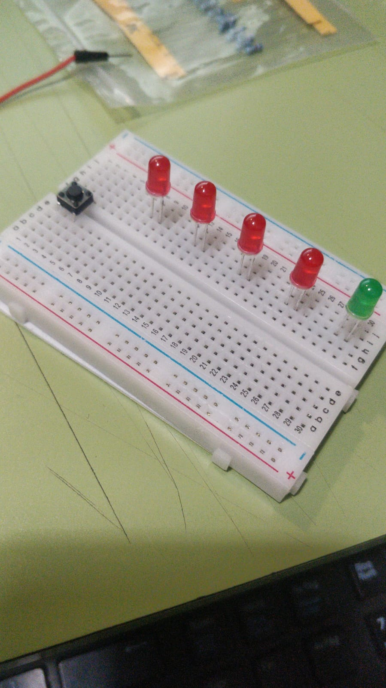
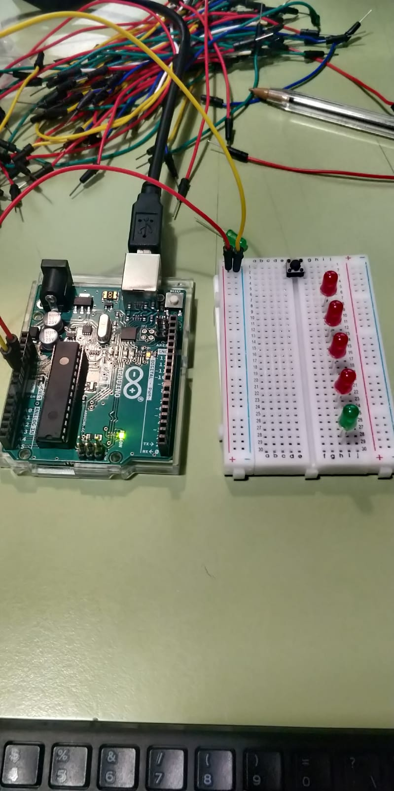
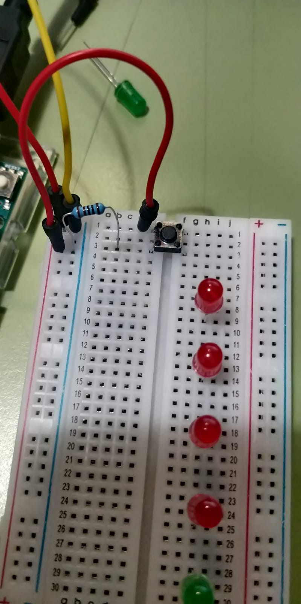
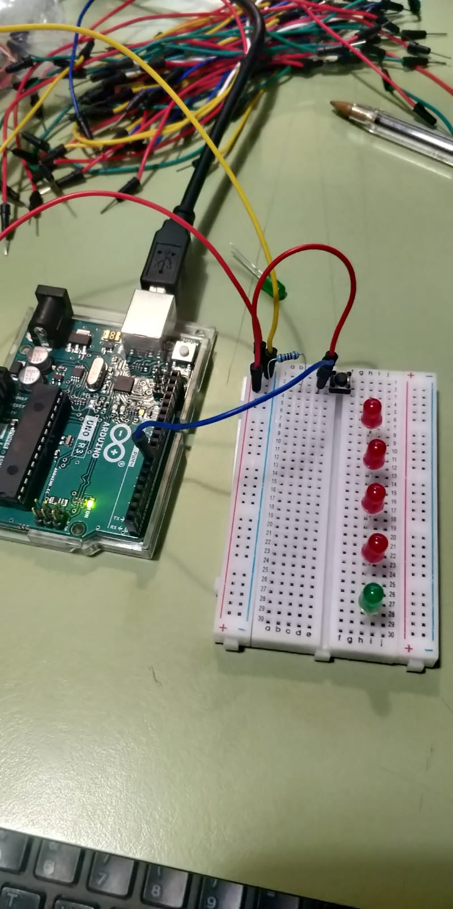

# aud5i022-2023-control

## pauta
Integrantes:
-Adrian Vasquez
-Camila Donoso
-Victoria Claveria

- imágenes
- 
- 
- 
- 
- conclusiones
"Con Pinina habíamos dicho; se puede hacer un semáforo" No pensamos que sería así de complejo. consideramos que la parte más terrible fue el inicio, encontrar el código base, una vez con eso, es bastante fácil de continuar programando y realizar el circuito. Si bien fue una experiencia compleja, creemos que el tener el apoyo de les profes fue fundamental para continuar, tal vez cinco clases no son suficientes para conquistar al munod, pero ayudan mucho. La parte de la perilla era simple en teoría, donde va el sensor, a tierra y a poder. Aún así, la práctica requiere un mayor conocimiento en cuanto a programación. Fue difícil, pero se pasó bien. Gracias c:

inspiracion: proyecto de estudiante del semestre pasado, semáforo de carreras fórmula 1

* https://github.com/jibbx/AV-ERDDEL

Nos inspiramos tambien en el trabajo que encontramos aca: https://forum.arduino.cc/t/proyecto-semaforo-de-carreras/436772

