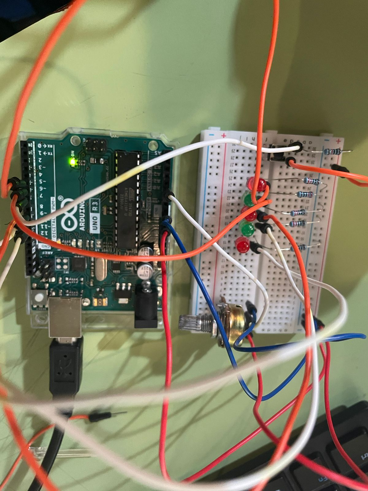
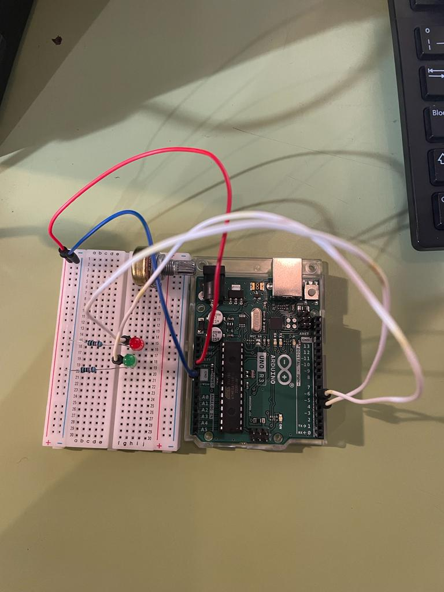
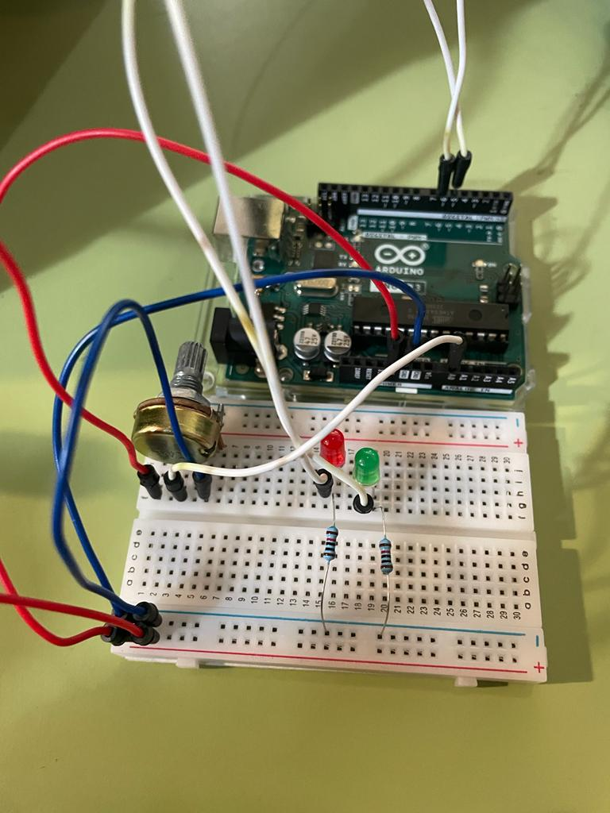
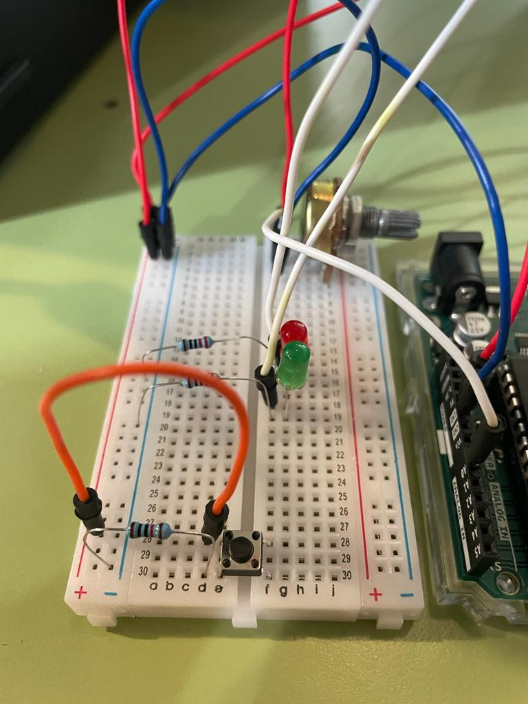
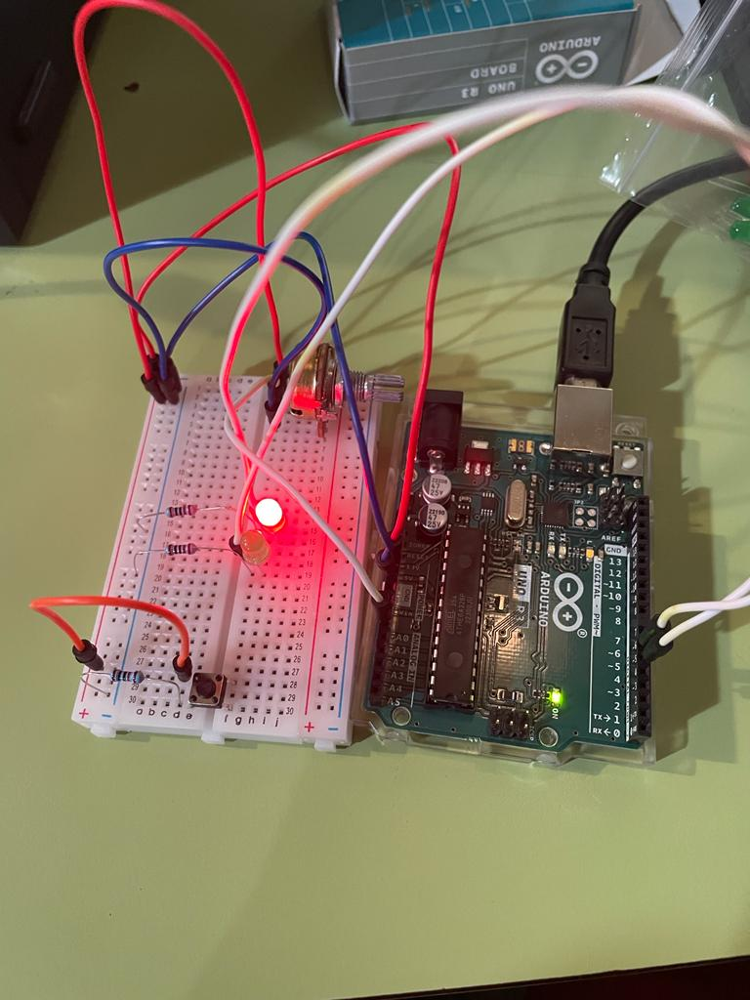
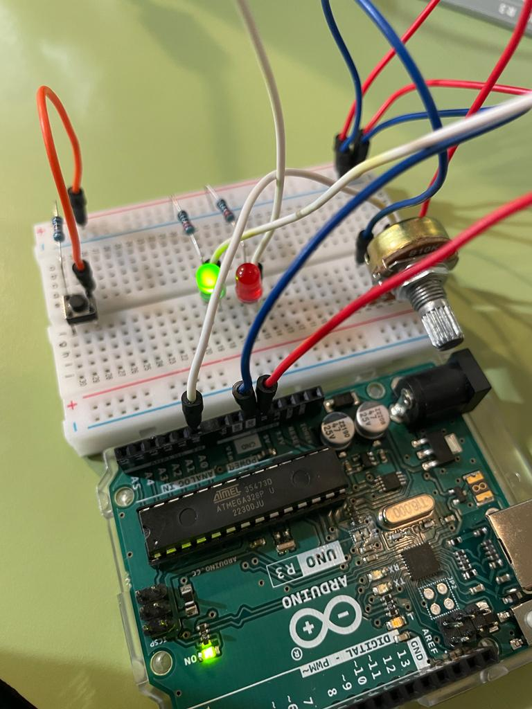
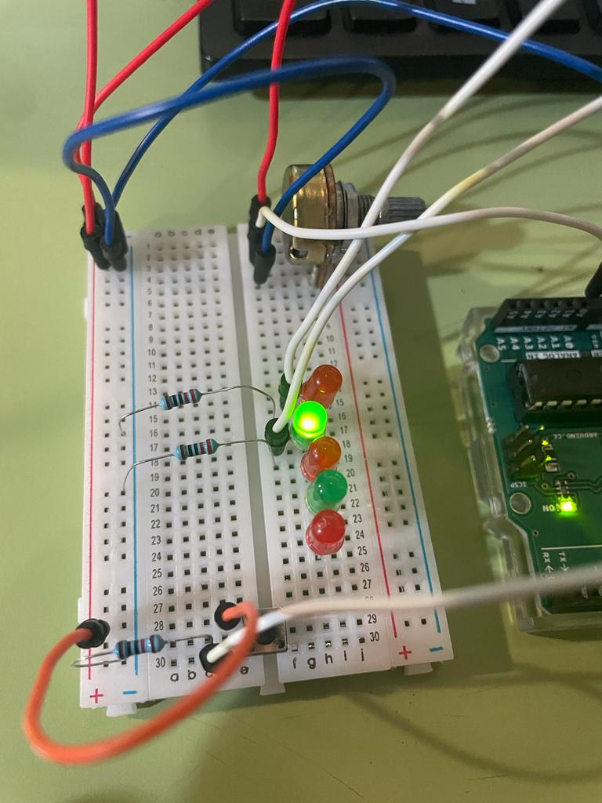

# aud5i022-2023-control

## pauta
- punto base
- asistencia
- materiales: ARDUINO 1, cable USB, Protoboard, 12 cables (4 blancos, 4 naranjos, 2 rojos, 2 azules), perilla, pulsador, 3 luces LED rojas, 2 luces LED verdes, 5 resistores de 220R, 1 resistor de 10k.

- circuito 

- código
// Integrantes: Javiera Torres Painevilo, Sofia Fuentes Duarte, Katherine Machuca Celis
// proyecto : 5 luces LED (roja, verde, roja, verde, roja) que prenden sucesivamente, con una perilla que regula la intensidad lumínica y un pulsador que al ser presionado apaga todas las luces.

// Pines digitales (~) en los que van conectadas cada luz led
int patitaLuz0 = 11;
int patitaLuz1 = 10;
int patitaLuz2 = 9;
int patitaLuz3 = 6;
int patitaLuz4 = 5;

// Pin analogo de la perilla
int patitaPerilla = A0;

//pulsador (al presionarlo apaga el circuito, al soltarlo vuelve a funcionar)
int pulsador = 7;

// Valores de partida
int valorPerilla = 0;
int valorLuz0 = 0;
int valorLuz1 = 0;
int valorLuz2 = 0;
int valorLuz3 = 0;
int valorLuz4 = 0;
int valorPulsador = 0;

//Valores de tiempo para todos los delay. Evita tener que cambiar los segundos manualmente desde el loop. 
//Si se modifica el tiempo desde aquí, se modifica igual para todas las luces led.
int pausa = 50;
int play = 300;

//Luz que se enciende
int cualLuz = 0;

void setup() {

  //Salidas de los led
  pinMode(patitaLuz0, OUTPUT);
  pinMode(patitaLuz1, OUTPUT);
  pinMode(patitaLuz2, OUTPUT);

  Serial.begin(9600);
}

void loop() {

  // si el boton pulsador esta presionado, aumentar en 1 el valor cualLuz

  valorPulsador = digitalRead(7);
  Serial.println(valorPulsador);

  if (valorPulsador == 0) {

    // actualizar valor luz
    //el dividido en 4 es para bajar la resolucion a un cuarto, ya no habria 1023 valores, sino que menos. Para que sean leibles por el LED.
    //valor perilla es de 0 a 1023
    //valor de la luz es de 0 a 255
    valorLuz0 = valorPerilla / 4;
    valorLuz1 = valorPerilla / 4;
    valorLuz2 = valorPerilla / 4;
    valorLuz3 = valorPerilla / 4;
    valorLuz4 = valorPerilla / 4;

    // tiempo que la luz esta prendida
    analogWrite(patitaLuz0, valorLuz0);
    delay(play);

    //tiempo que la luz esta apagada
    digitalWrite(patitaLuz0, 0);
    delay(pausa);

    analogWrite(patitaLuz1, valorLuz1);
    delay(play);
    digitalWrite(patitaLuz1, 0);
    delay(pausa);

    analogWrite(patitaLuz2, valorLuz2);
    delay(play);
    digitalWrite(patitaLuz2, 0);
    delay(pausa);

    analogWrite(patitaLuz3, valorLuz3);
    delay(play);
    digitalWrite(patitaLuz3, 0);
    delay(pausa);

    analogWrite(patitaLuz4, valorLuz4);
    delay(play);
    digitalWrite(patitaLuz4, 0);
    delay(pausa);

    analogWrite(patitaLuz3, valorLuz3);
    delay(play);
    digitalWrite(patitaLuz3, 0);
    delay(pausa);

    analogWrite(patitaLuz2, valorLuz2);
    delay(play);
    digitalWrite(patitaLuz2, 0);
    delay(pausa);

    analogWrite(patitaLuz1, valorLuz1);
    delay(play);
    digitalWrite(patitaLuz1, 0);
    delay(pausa);

  } else {
    analogWrite(patitaLuz0, LOW);
    analogWrite(patitaLuz1, LOW);
    analogWrite(patitaLuz2, LOW);
    analogWrite(patitaLuz3, LOW);
    analogWrite(patitaLuz4, LOW);
// if: si el pulsador NO esta presionado, funciona lo que esta en los {}.
// else: si sucede lo contrario (pulsador SI esta presionado), se apagan todas las luces (LOW)
  }

  valorPerilla = analogRead(patitaPerilla);
  Serial.println(valorPerilla);
}

- conclusiones: fue difícil conectar la primera luz, pero una vez que logramos hacer eso las demás fueron más fáciles. Nos costó conectar el pulsador y la perilla al circuito de las luces, es decir, lograr que interactuarán con las luces. Al principio, algo que se nos dificultó fue la escritura del código y ponerle los nombres a cada cosa y acordarse de qué significaban.
Mediante este trabajo logramos reforzar los contenidos vistos previamente y los pudimos relacionar unos con otros de forma satisfactoria al final. Logramos desarrollar la idea original que teníamos (un circuito con luces que brillaban en distintos tiempos, y cuya intensidad era regulada mediante la perilla), y a esta idea le añadimos un pulsador y más luces.

inspiracion: Materia vista en clases 3, 4 y 5 (para saber como usar cada componente del circuito tanto de forma análoga como digital), proyectos que vimos de otros compañeros en esta misma clase.

* https://github.com/jibbx/AV-ERDDEL

imagenes 

Pusimos las cosas base para comenzar a probar (luz led con su resistor, perilla y pulsador)

Empezamos a añadir más cosas. Otra luz led, con cables y resistor de 220R respectivo. Hicimos las conexiones para la perilla y quitamos el pulsador (por ahora).

Pusimos el pulsador nuevamente, le pusimos su cable a los 5V y resistor de 10k

Hicimos la primera prueba subiendo el código al Arduino. Funciona solo una luz por ahora, ya que para la prueba solo usamos esta. (Ver "video1" en carpeta de archivos).

Luego de verificar que funcionaba, probamos tambien con la luz verde.

Añadimos mas luces led al circuito para que fuera más interesante y tambien se agregaron al software (Ver "video2" en carpeta de archivos).

