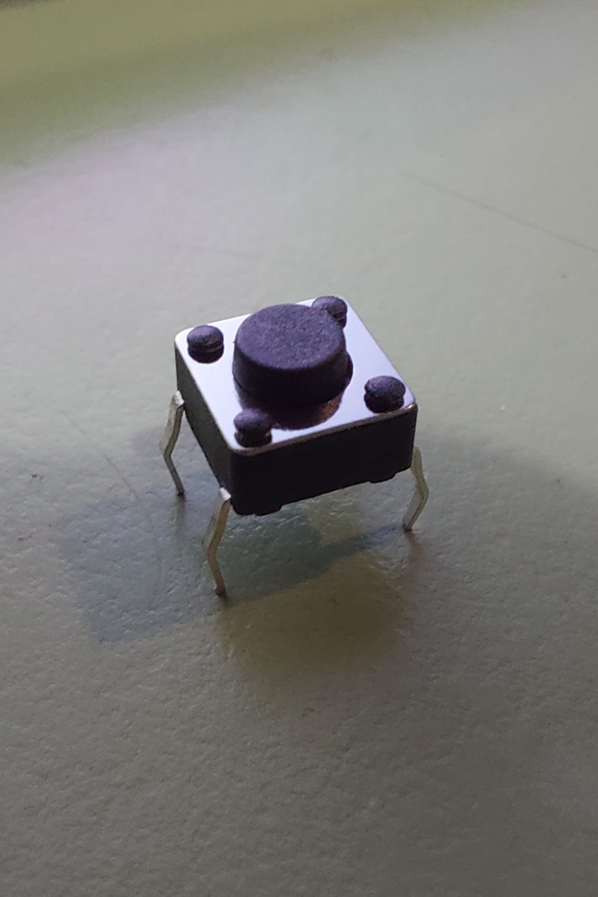
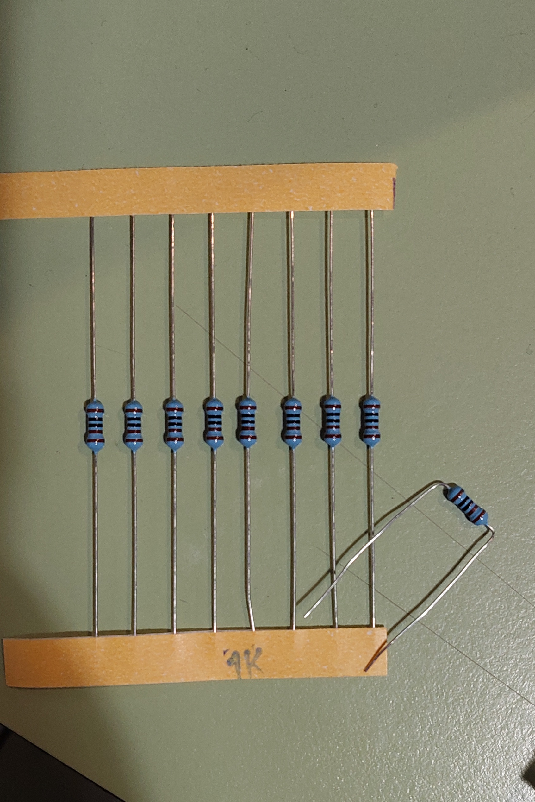
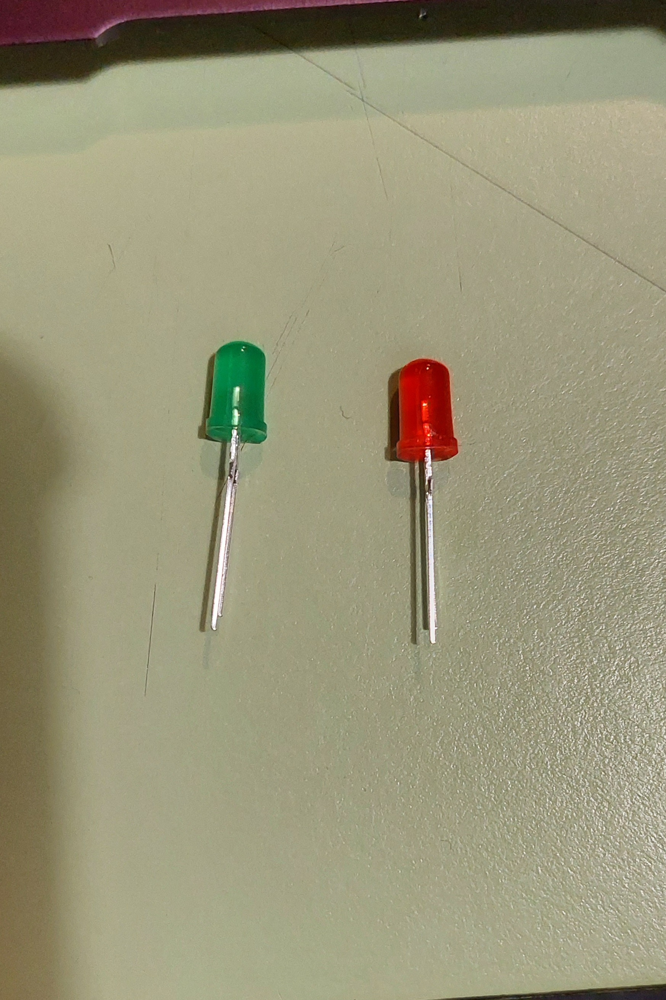

# aud5i022-2023-control

## pauta

- punto base
- asistencia
- materiales
- circuito
- código
- imágenes
- conclusiones

inspiracion: proyecto de estudiante del semestre pasado

* https://github.com/jibbx/AV-ERDDEL


# Control: Press 2 Cross

Somos **Randall Dávalos y Laura Simunovic**, estudiantes de la asignatura ****Diseño de interfaz electrónica mediante Arduino: AUD5I022-1**** 

Realizaremos, utilizando Arduino UNO y Arduino, un semáforo que realice las siguientes acciones: utilizando el botón pulsador primero se encenderá el LED Rojo, este no cambiará hasta pulsar por segunda vez el ‘botón pulsador’, hecho esto el LED Rojo titilará para dar paso al LED Verde que luego se apagará y volverá al LED Rojo sin necesidad de apretar nuevamente el botón pulsador.

# Materiales utilizados:

Software: Arduino IDE 2.10


Arduino UNO.


Breadboard. 



Botón/pulsador



Resistencia de 1k.



Luces LED. 

# Circuito


Primeros intentos de circuito para ejecutar el ‘Press 2 Cross’


segundo intento, ahora colocando más elementos con el  propósito de saber si ‘funciona’


Circuito completo. 


Circuito completo y funcionando. 

# Código

Luego de realizado el circuito, empezamos a trabajar en el código que le daría vida a nuestro semáforo. 

Comenzamos por utilizar el código de pulsador luz intermitente de la clase 4 como base. 

```c
// ej_01_pulsador_luz
// por montoyamoraga
// v0.0.1 abril 2022
// hecho con Arduino Uno y IDE 1.8.19

// variable para leer info
int pinLectura = 7;

// variable para almacenar estado pulsador
int estadoPulsador = 0;

// variable para conectar LED
int pinLED = 6;

// variable para estado LED
int estadoLED = 0;

void setup() {

  // definir pin lectura como entrada digital
  pinMode(pinLectura, INPUT);

  // definir pin LED como salida digital
  pinMode(pinLED, OUTPUT);

  // abrir comunicacion serial
  Serial.begin(9600);

}

void loop() {

  // leer pin y actualizar variable interna
  estadoPulsador = digitalRead(pinLectura);

  // imprimir informacion por puerto serial
  Serial.println(estadoPulsador);

  // actualizar estado LED
  estadoLED = estadoPulsador;

  // usar salida digital para controlar LED
  digitalWrite(pinLED, estadoLED);

  // pausa de 1000 milisegundos
  delay(1000);

}
```

Con este código base, empezamos por redefinir las variables, para poder trabajar con dos luces, en lugar de una. 

```c
// variable para leer info
int pinLectura = 7;

// variable para almacenar estado pulsador
int estadoPulsador = 0;

// variables para conectar LED (rojo y verde)
int pinRojo = 6;
int pinVerde = 5;

// variables para estado LED (rojo y verde)
int estadoRojo = 0;
int estadoVerde = 0

void setup() {

  // definir pin lectura como entrada digital
  pinMode(pinLectura, INPUT);

  // definir pins Rojo y Verde como salidas digitales
  pinMode(pinRojo, OUTPUT);
  pinMode(pinVerde, OUTPUT);
}
```

Después, definimos lo que ocurriría cuando se presionase el botón, además, modificamos el código para trabajar con tres intervalos. 

```c
// "Semáforo pulsador"
// Realizado por Randall Dávalos y Laura Simunovic. 
// En base a "ej_02_pulsador_luz_intermitente_delay" por montoyamoraga.
// 28 de abril 2023

// variable para leer info
int pinLectura = 7;

// variable para almacenar estado pulsador
int estadoPulsador = 0;

// variables para conectar LED (rojo y verde)
int pinRojo = 6;
int pinVerde = 5;

// variables para estado LED (rojo y verde)
int estadoRojo = 0;
int estadoVerde = 0;

// variables para intervalos de intermitencia
int intervalo1 = 3000;
int intervalo2 = 200;
int intervalo3 = 600;

void setup() {

  // definir pin lectura como entrada digital
  pinMode(pinLectura, INPUT);

  // definir pins Rojo y Verde como salidas digitales
  pinMode(pinRojo, OUTPUT);
  pinMode(pinVerde, OUTPUT);
}

void loop() {

  // leer pin y actualizar variable interna
  estadoPulsador = digitalRead(pinLectura);

  // si pulsador esta presionado
  if (estadoPulsador == HIGH) {

    // Intermitencia de luz roja
    estadoRojo = LOW;
    delay(intervalo2);
    estadoRojo = HIGH;
    delay(intervalo2);
    estadoRojo = LOW;
    digitalWrite(pinRojo, estadoRojo);
    delay(intervalo3);

  }
}
```

Inicialmente, no funcionó el código como queríamos, saltandose la intermitencia. Preguntamos, y esto se debía a que no estabamos envíando la información de cambio de estado rojo, por lo que agregamos esto. 

```c
// "Semáforo pulsador"
// Realizado por Randall Dávalos y Laura Simunovic. 
// En base a "ej_02_pulsador_luz_intermitente_delay" por montoyamoraga.
// 28 de abril 2023

// variable para leer info
int pinLectura = 7;

// variable para almacenar estado pulsador
int estadoPulsador = 0;

// variables para conectar LED (rojo y verde)
int pinRojo = 6;
int pinVerde = 5;

// variables para estado LED (rojo y verde)
int estadoRojo = 0;
int estadoVerde = 0;

// variables para intervalos de intermitencia
int intervalo1 = 3000;
int intervalo2 = 200;
int intervalo3 = 600;

void setup() {

  // definir pin lectura como entrada digital
  pinMode(pinLectura, INPUT);

  // definir pins Rojo y Verde como salidas digitales
  pinMode(pinRojo, OUTPUT);
  pinMode(pinVerde, OUTPUT);
}

void loop() {

  // leer pin y actualizar variable interna
  estadoPulsador = digitalRead(pinLectura);

  // si pulsador esta presionado
  if (estadoPulsador == HIGH) {

    // Intermitencia de luz roja
    estadoRojo = LOW;
    digitalWrite(pinRojo, estadoRojo);
    delay(intervalo2);
    estadoRojo = HIGH;
    digitalWrite(pinRojo, estadoRojo);
    delay(intervalo2);
    estadoRojo = LOW;
    digitalWrite(pinRojo, estadoRojo);
    delay(intervalo3);

    // Prender luz verde, y mantener prendida por un intervalo"1" de tiempo. 
    estadoRojo = LOW;
    estadoVerde = HIGH;
    digitalWrite(pinRojo, estadoRojo);
    digitalWrite(pinVerde, estadoVerde);
    delay(intervalo1);
  }
```

Finalmente, definimos que la luz roja se mantendría prendida mientras no se presione el pulsador. 

```c
// "Semáforo pulsador"
// Realizado por Randall Dávalos y Laura Simunovic. 
// En base a "ej_02_pulsador_luz_intermitente_delay" por montoyamoraga.
// 28 de abril 2023

// variable para leer info
int pinLectura = 7;

// variable para almacenar estado pulsador
int estadoPulsador = 0;

// variables para conectar LED (rojo y verde)
int pinRojo = 6;
int pinVerde = 5;

// variables para estado LED (rojo y verde)
int estadoRojo = 0;
int estadoVerde = 0;

// variables para intervalos de intermitencia
int intervalo1 = 3000;
int intervalo2 = 200;
int intervalo3 = 600;

void setup() {

  // definir pin lectura como entrada digital
  pinMode(pinLectura, INPUT);

  // definir pins Rojo y Verde como salidas digitales
  pinMode(pinRojo, OUTPUT);
  pinMode(pinVerde, OUTPUT);
}

void loop() {

  // leer pin y actualizar variable interna
  estadoPulsador = digitalRead(pinLectura);

  // si pulsador esta presionado
  if (estadoPulsador == HIGH) {

    // Intermitencia de luz roja
    estadoRojo = LOW;
    digitalWrite(pinRojo, estadoRojo);
    delay(intervalo2);
    estadoRojo = HIGH;
    digitalWrite(pinRojo, estadoRojo);
    delay(intervalo2);
    estadoRojo = LOW;
    digitalWrite(pinRojo, estadoRojo);
    delay(intervalo3);

    // Prender luz verde, y mantener prendida por un intervalo"1" de tiempo. 
    estadoRojo = LOW;
    estadoVerde = HIGH;
    digitalWrite(pinRojo, estadoRojo);
    digitalWrite(pinVerde, estadoVerde);
    delay(intervalo1);
  }

  // si pulsador no esta presionado
  else {

    //luz roja se encuentra prendida, verde se encuentra apagada. 
    estadoRojo = HIGH;
    estadoVerde = LOW;
    digitalWrite(pinRojo, estadoRojo);
    digitalWrite(pinVerde, estadoVerde);
  }
}
```

Logrado esto, registramos el siguiente vídeo:

(20230428_170010_1.mp4)

# Conclusiones:

Por mi parte (Randall) encontré cierta dificultad en realizar el proyecto. Si bien entendí como funcionaban ciertas partes del código al utilizar de base lo proporcionado por montoyamoraga (clase 4), fue complicado reconocer que cosas debía eliminar y cuales necesitaba duplicar. Fue un buen aprendizaje y comienzo de empezar a hacer cosas por si mismo, ya que hasta ahora habiamos estado realizando codigos con guía. 

En lo personal (Laura), no tuve mayores dificultades con las secciones del código que contaban con comentarios explicativos, pero aún me falta conocimeitno paara saber de forma más intuitiva lo que hacen todas las partes del código. Aún así, resultó muy entrtenido. 
