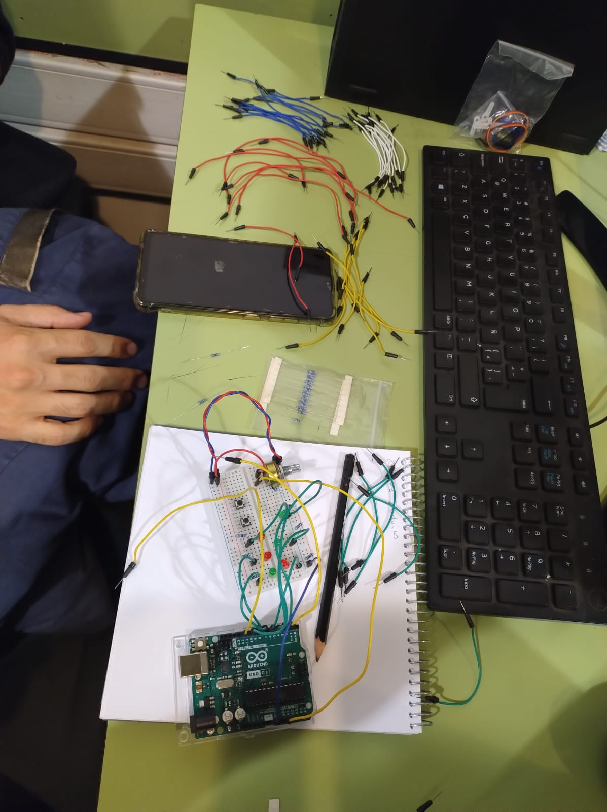
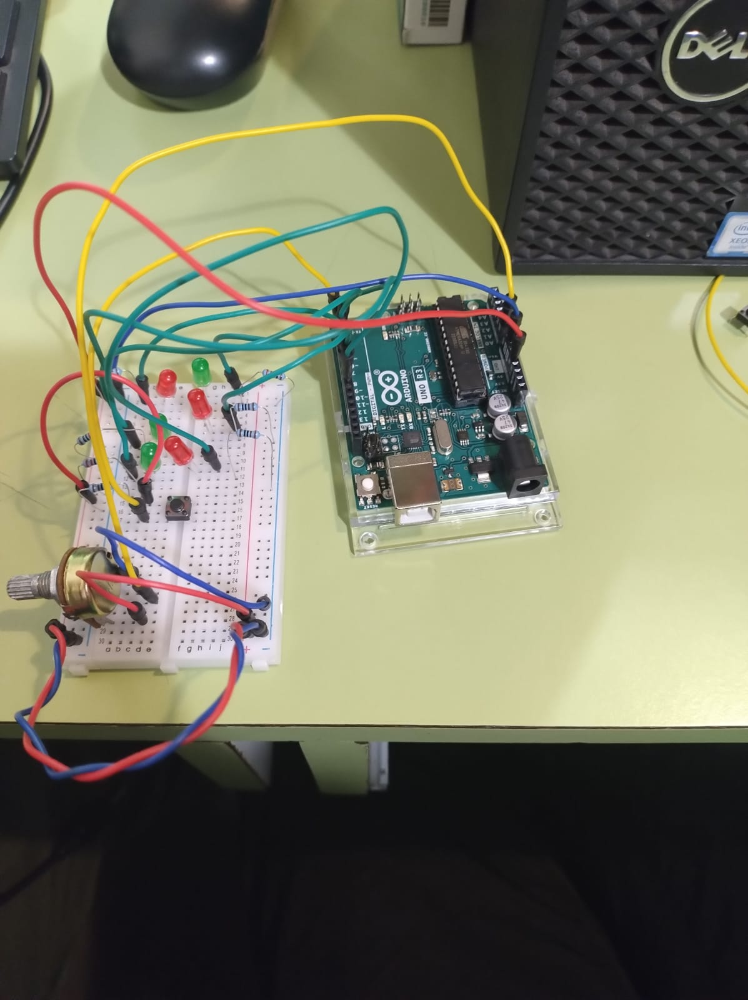
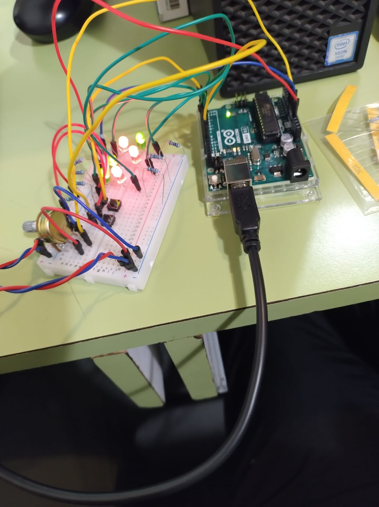

# aud5i022-2023-control

## pauta

- punto base
- asistencia
- materiales
- circuito
- código
- imágenes
- conclusiones

# Entrega 1

## Vanesa Angulo - Francisco Cabrera

Objetivo: Implementar patrones en los leds,con la condicion que al de apretar botones estos cambien de sentido de movimiento y el potenciador regule la intendidad de estos.

- Materiales
  15 Cables, 1 Protobot, 7 resistencias 2k, 6 leds, 1 Arduino, 1 Potenciador, 1 botón
  

- Circuito CONEXIONES
  

- Circuito 1 LEDS
  

- Codigo y función

// estas son las variables

int LED4 = 4;
int LED5 = 5;
int LED6 = 6;

int LED8 = 8;
int LED9 = 9;
int LED10 = 10;

int Boton1 = 2;

int estadoBoton = 0;
int estadoBotonPrevio = 0;

int Pausa = 50;

void setup() {
//establecer el rol de cada participante

pinMode(LED4, OUTPUT);
pinMode(LED5, OUTPUT);
pinMode(LED6, OUTPUT);

pinMode(LED8, OUTPUT);
pinMode(LED9, OUTPUT);
pinMode(LED10, OUTPUT);

pinMode(Boton1, INPUT);
Serial.begin(9600);
}

void loop() {

estadoBoton = digitalRead(Boton1);
Serial.print(estadoBoton);
Serial.println("");

//Intento de hacer que el boton funcione como switch (mantener su valor 1 o 0 y solo cambiarlo al ser apretado)
/\*
if(estadoBotonPrevio == LOW && estadoBoton == HIGH) {
botonApretado = ~botonApretado;

    Serial.print("botonApretado: ");
    Serial.println(botonApretado);
    Serial.println("");

}
estadoBotonPrevio = estadoBoton;
\*/

//apagar todos los LEDS
digitalWrite(LED4, LOW);
digitalWrite(LED5, LOW);
digitalWrite(LED6, LOW);
digitalWrite(LED8, LOW);
digitalWrite(LED9, LOW);
digitalWrite(LED10, LOW);

//Patron de LED si el boton no es apretado
if (estadoBoton == 0) {
digitalWrite(LED4, HIGH);
delay(Pausa);
digitalWrite(LED4, LOW);
digitalWrite(LED5, HIGH);
delay(Pausa);
digitalWrite(LED5, LOW);
digitalWrite(LED6, HIGH);
delay(Pausa);
digitalWrite(LED6, LOW);
digitalWrite(LED8, HIGH);
delay(Pausa);
digitalWrite(LED8, LOW);
digitalWrite(LED9, HIGH);
delay(Pausa);
digitalWrite(LED9, LOW);
digitalWrite(LED10, HIGH);
delay(Pausa);
digitalWrite(LED10, HIGH);
delay(Pausa);
digitalWrite(LED10, LOW);
delay(Pausa);
//Patron de LED si el boton esta siendo apretado
} else {
digitalWrite(LED10, HIGH);
delay(Pausa);
digitalWrite(LED10, LOW);
digitalWrite(LED9, HIGH);
delay(Pausa);
digitalWrite(LED9, LOW);
digitalWrite(LED8, HIGH);
delay(Pausa);
digitalWrite(LED8, LOW);
digitalWrite(LED6, HIGH);
delay(Pausa);
digitalWrite(LED6, LOW);
digitalWrite(LED5, HIGH);
delay(Pausa);
digitalWrite(LED5, LOW);
digitalWrite(LED4, HIGH);
delay(Pausa);
digitalWrite(LED4, LOW);
delay(Pausa);
}
}

Función se encuentra en el archivo adjunto "circuito"

## Conclusión

Pudimos aplicar los conocimeintos aprendidos en clases en la realizacion del control, maxificandolo a una mayor cantidad de leds y aplicanco no solo una funcion de encendido y apagado sino patrones de movimiento. El potenciador por temas de tiempo no pudimos implementarlo en el codigo, pero esta incluido en el circuito.
