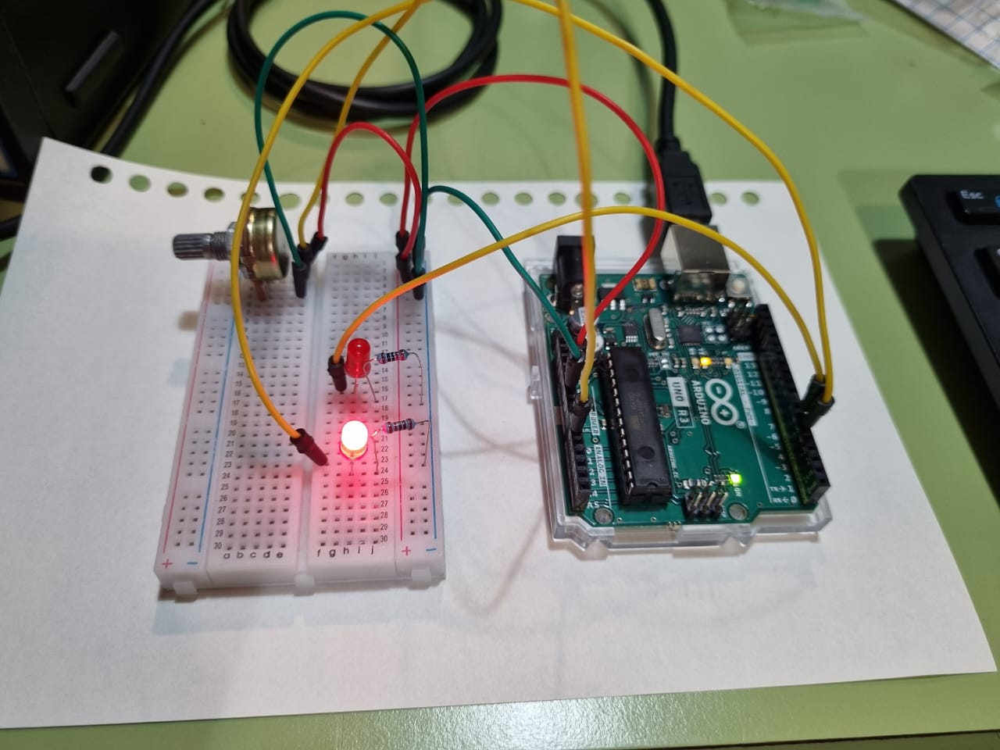
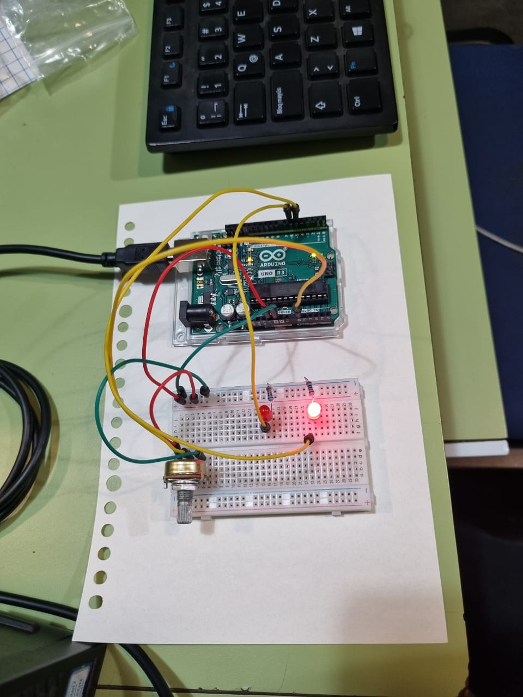

# aud5i022-2023-control

## pauta

- punto base
- asistencia

- materiales
   -arduino uno
   -dos resistencias de 220R
   -dos led rojos
   -una perilla
   -dos cables verdes
   -dos cables rojos
   -tres cables amarillos
   
- circuito
 
- código
// nombre: silvana olivares, pilar vergara, valentina fuentes
//fecha: 28/04/2023
// al mover la perilla
// cambia la intensidad de la luz
// una luz incrementa y la otra decrece

// fuentes
// https://github.com/kquita/aud5i022-2023-1/blob/main/kquita/clase_21_04/clase_21_04.ino

int patitaLuz0 = 5;
int patitaLuz1 = 6;

//entrada analogica
int estadoPerilla;

// salidas analogicas
int luz0;
int luz1;

void setup() {

  pinMode(patitaLuz0, OUTPUT);
  pinMode(patitaLuz1, OUTPUT);
  Serial.begin(9600);
}

void loop() {
  estadoPerilla = analogRead(A0);
  Serial.println(estadoPerilla);

  // se divide para bajar la resolucion, al ser dos enteros el resultado va a ser un entero, lo demás es sobrante y lo ignora
  
  luz0 = estadoPerilla / 4;
  analogWrite(patitaLuz0, luz0);
  

  // luz1 es el maximo menos luz0
  // la suma de luz0 y luz1 siempre da 255
  luz1 = 255 - luz0;
  analogWrite(patitaLuz1, luz1);
}

- imágenes

- conclusiones
Al tratar de aplicarlo en distintos computadores no obtuvimos el mismo efecto deseado. 
Generó una dificultad que no pudimos resolver por nuestra cuenta
Tambien enfrentamos dificultades al integrár más leds al circuito asignando rangos a la perilla 

