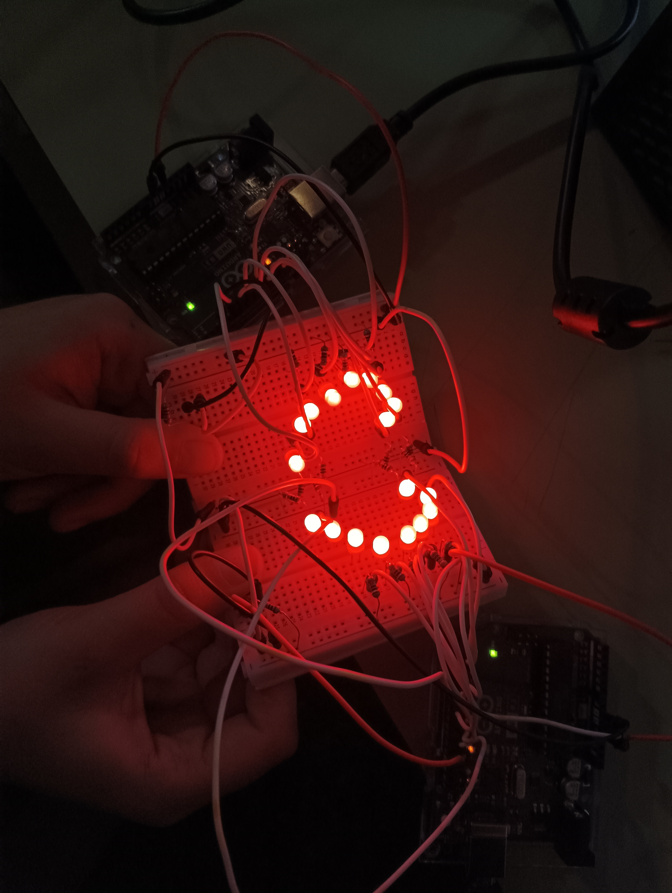

# aud5i022-2023-control

## pauta

- integrantes: Sofia Chávez y María Díaz Valdivia
- punto base
- asistencia
- materiales: dos Arduino uno, dos protoboard, 18 led, un botón, 19 resistencias, 31 cables.
- circuito


- código

```cpp
// encaro 1 28/04/2023
// mitad Sofi <3 derecha
// hecho con Arduino Uno y IDE 1.8.19

// variable para leer info
int pinLectura = 12;

// variable para almacenar estado pulsador
int estadoPulsador = 0;

// variable para conectar LED
int pinLED = 2;
int pinLEDDOS = 3;
int pinLEDTRES = 4;
int pinLEDCUATRO = 5;
int pinLEDCINCO = 6;
int pinLEDSEIS = 7;
int pinLEDSIETE = 8;
int pinLEDOCHO = 9;
int pinLEDNUEVE = 10;


// variable para estado LED
int estadoLED = 0;

// variable para pausa de intermitencia
const long intervalo = 100;

unsigned long tiempoAnterior = 0;
unsigned long tiempoActual = 0;

void setup() {

  // definir pin lectura como entrada digital
  pinMode(pinLectura, INPUT);

  // definir pin LED como salida digital
  pinMode(pinLED, OUTPUT);
  pinMode(pinLEDDOS, OUTPUT);
  pinMode(pinLEDTRES, OUTPUT);
  pinMode(pinLEDCUATRO, OUTPUT);
  pinMode(pinLEDCINCO, OUTPUT);
  pinMode(pinLEDSEIS, OUTPUT);
  pinMode(pinLEDSIETE, OUTPUT);
  pinMode(pinLEDOCHO, OUTPUT);
  pinMode(pinLEDNUEVE, OUTPUT);

}

void loop() {

  // leer pin y actualizar variable interna
  estadoPulsador = digitalRead(pinLectura);

  // si el boton no esta presionado
  if (estadoPulsador == LOW) {
  
    estadoLED = LOW;
    digitalWrite(pinLED, LOW);
    digitalWrite(pinLEDDOS, LOW);
    digitalWrite(pinLEDTRES, LOW);
    digitalWrite(pinLEDCUATRO, LOW);
    digitalWrite(pinLEDCINCO, LOW);
    digitalWrite(pinLEDSEIS, LOW);
    digitalWrite(pinLEDSIETE, LOW);
    digitalWrite(pinLEDOCHO, LOW);
    digitalWrite(pinLEDNUEVE, LOW);
    
  }

  // si el boton esta presionado
  else {

      //estadoLED = !estadoLED;
      digitalWrite(pinLED, HIGH);
      delay(100);
      digitalWrite(pinLED, LOW);


      digitalWrite(pinLEDDOS, HIGH);
      delay(100);
      digitalWrite(pinLEDDOS, LOW);

      digitalWrite(pinLEDTRES, HIGH);
      delay(100);
      digitalWrite(pinLEDTRES, LOW);

      digitalWrite(pinLEDCUATRO, HIGH);
      delay(100);
      digitalWrite(pinLEDCUATRO, LOW);

      digitalWrite(pinLEDCINCO, HIGH);
      delay(100);
      digitalWrite(pinLEDCINCO, LOW);

      digitalWrite(pinLEDSEIS, HIGH);
      delay(100);
      digitalWrite(pinLEDSEIS, LOW);
      
      digitalWrite(pinLEDSIETE, HIGH);
      delay(100);
      digitalWrite(pinLEDSIETE, LOW);

      digitalWrite(pinLEDOCHO, HIGH);
      delay(100);
      digitalWrite(pinLEDOCHO, LOW);

      digitalWrite(pinLEDNUEVE, HIGH);
      delay(100);
      digitalWrite(pinLEDNUEVE, LOW);


  }

}

// encargo 1 28/04/23
// mitad Mari <3 izquierda
// hecho con Arduino Uno y IDE 1.8.19

// variable para leer info
int pinLectura = 3;

// variable para almacenar estado pulsador
int estadoPulsador = 0;

// variable para conectar LED
int pinLED = 13;
int pinLEDDOS = 12;
int pinLEDTRES = 11;
int pinLEDCUATRO = 10;
int pinLEDCINCO = 9;
int pinLEDSEIS = 8;
int pinLEDSIETE = 7;
int pinLEDOCHO = 6;
int pinLEDNUEVE = 5;

// variable para estado LED
int estadoLED = 0;

// variable para pausa de intermitencia
const long intervalo = 1000;

unsigned long tiempoAnterior = 0;
unsigned long tiempoActual = 0;

void setup() {

  // definir pin lectura como entrada digital
  pinMode(pinLectura, INPUT);

  // definir pin LED como salida digital
 
  pinMode(pinLED, OUTPUT);
  pinMode(pinLEDDOS, OUTPUT);
  pinMode(pinLEDTRES, OUTPUT);
  pinMode(pinLEDCUATRO, OUTPUT);
  pinMode(pinLEDCINCO, OUTPUT);
  pinMode(pinLEDSEIS, OUTPUT);
  pinMode(pinLEDSIETE, OUTPUT);
  pinMode(pinLEDOCHO, OUTPUT);
  pinMode(pinLEDNUEVE, OUTPUT);

}

void loop() {

  // leer pin y actualizar variable interna
  estadoPulsador = digitalRead(pinLectura);

  // si el boton no esta presionado
  if
   (estadoPulsador == LOW) {
    estadoLED = LOW;
    digitalWrite(pinLED, LOW);
    digitalWrite(pinLEDDOS, LOW);
    digitalWrite(pinLEDTRES, LOW);
    digitalWrite(pinLEDCUATRO, LOW);
    digitalWrite(pinLEDCINCO, LOW);
    digitalWrite(pinLEDSEIS, LOW);
    digitalWrite(pinLEDSIETE, LOW);
    digitalWrite(pinLEDOCHO, LOW);
    digitalWrite(pinLEDNUEVE, LOW);
    
  }

  // si el boton esta presionado
   else {
    digitalWrite(pinLED, HIGH);
    delay(100);
   digitalWrite(pinLED, LOW);

    digitalWrite(pinLEDDOS, HIGH);
    delay (100);
    digitalWrite(pinLEDDOS, LOW);

    digitalWrite(pinLEDTRES, HIGH);
    delay(100);
    digitalWrite(pinLEDTRES, LOW);
    
    digitalWrite(pinLEDCUATRO, HIGH);
    delay(100);
    digitalWrite(pinLEDCUATRO, LOW);

    digitalWrite(pinLEDCINCO, HIGH);
    delay(100);
    digitalWrite(pinLEDCINCO, LOW);

    digitalWrite(pinLEDSEIS, HIGH);
    delay(100);
    digitalWrite(pinLEDSEIS, LOW);

    digitalWrite(pinLEDSIETE, HIGH);
    delay(100);
    digitalWrite(pinLEDSIETE, LOW);

    digitalWrite(pinLEDOCHO, HIGH);
    delay(100);
    digitalWrite(pinLEDOCHO, LOW);

    digitalWrite(pinLEDNUEVE, HIGH);
    delay(100);
    digitalWrite(pinLEDNUEVE, LOW);

  }

}
```

- imágenes



- conclusiones
Para crear un circuito se debe tener alma y un propósito, y en nuestro caso quisimos probar que dos arduinos se pueden entrelazar y crear algo hermoso <3

y apesar de que fue muy confuso con una idea clara pudimos perserverar para cumplirla. :D
tuvimos muchas opciones para que las luces se encendieran de cierta forma pero decidimos elegir el mejor medio posible para representar de mejor forma nuestra idea, que fue prender todas las luces al mismo tiempo con un solo botón

inspiracion: proyecto de estudiante del semestre pasado

* https://github.com/jibbx/AV-ERDDEL


