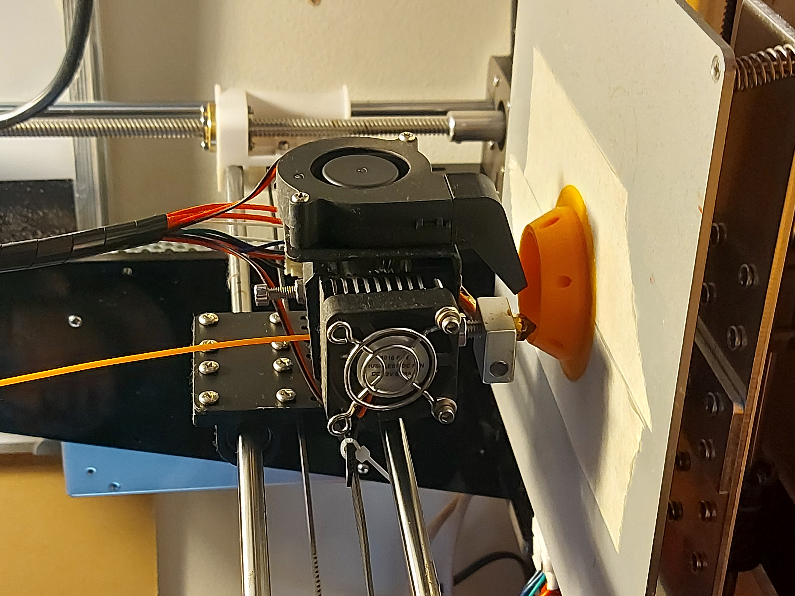
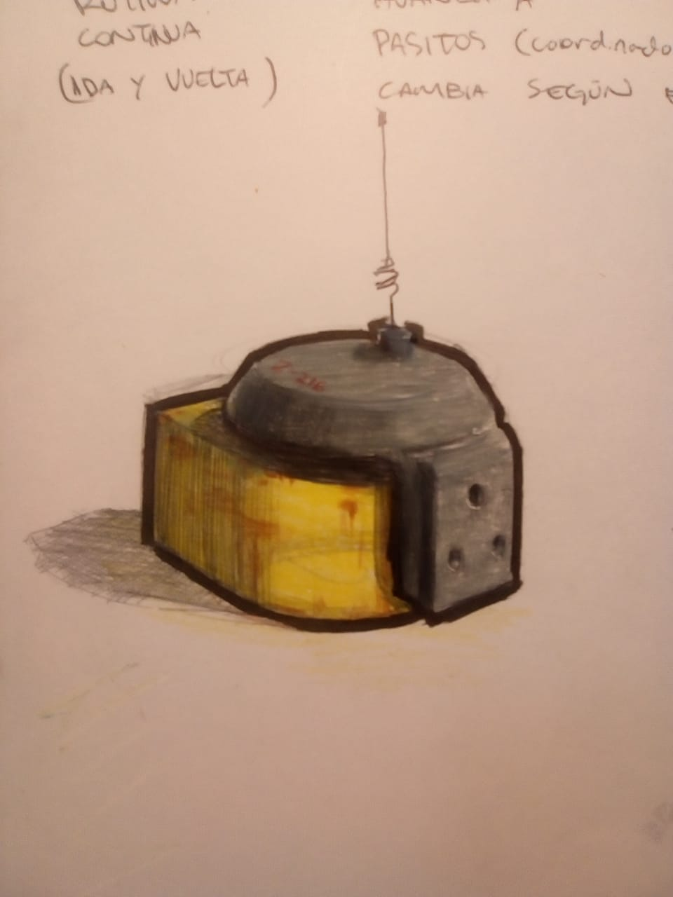
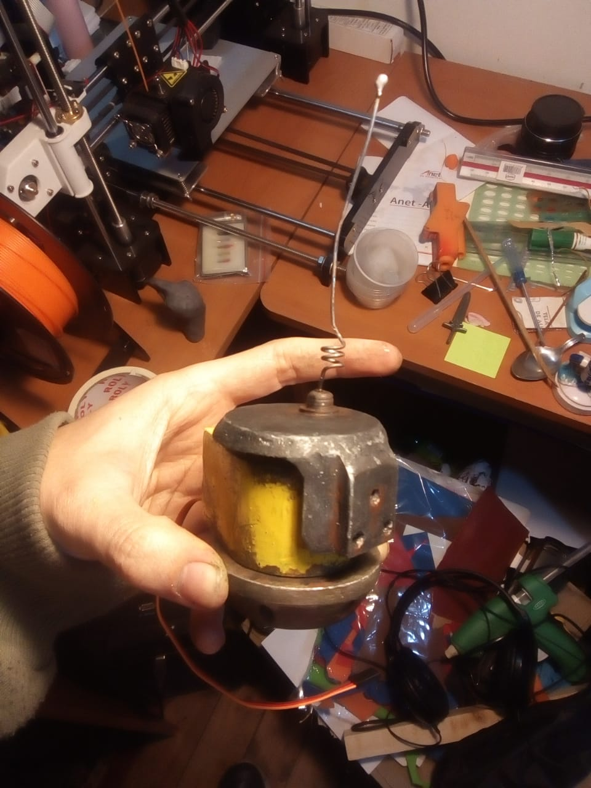
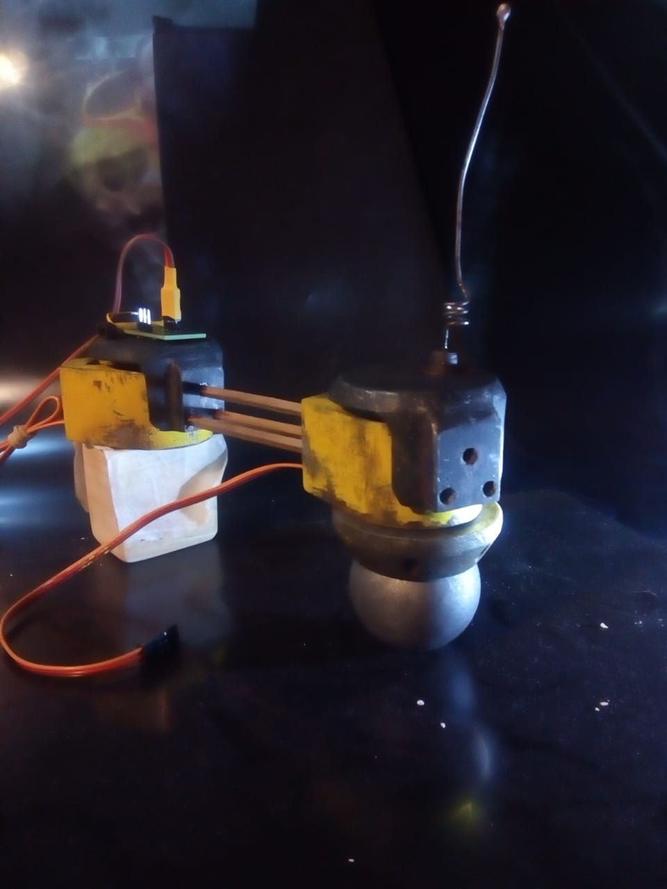

# Zerboi 216
Autores:  
[AndresMartin](https://github.com/AndresMartinM) 
[AmSayen](https://github.com/AmSayen)  
Junio 2023  
Para aud5i022-2023-1. Diseño de interfaz eletrónica mediante Arduino. FAU, UChile  
Docentes: Aaron Montoya Moraga e Ignacio Passalacqua   

## Descripción
### ¿Quién es Zerboi 216?
Hola! soy robot artista, mi pasión son las formas de arcos. Trabajo muy duro, pero no soy tan talentoso.

### ¿Cómo funciona Zerboi 216?
Uso la interfaz de Arduino Uno y me manifiesto en el mundo físico a través de:
#### Materiales:
+ Arduino Uno
+ 2 Servomotor SG90
+ Fotorresistor 12528 LDR
+ Placa PCB Perforada Doble Capa 2x8cm con:
  - Resistor 220 ohm
  - Regletas 90°: 2 de 3 pines y 1 de 2 pines
  - Regletas: 2 de 6 pines y 2 de 3 pines
  - Alambre de cobre 0.2 mm
  - Estaño para soldadura
+ Cables innie-innie
+ Piezas manufacturadas con impresión 3D con PLA 
+ 3 palos de maquieta, 3mm
+ Retazo de madera para la base
+ Pelota de pingpong
+ Lápiz
+ Hoja

#### Software:
Arduino IDE 2.0.3

## Armado de circuito
Para poder construirme es necesario:  
1. Conectar el primer servo (ServoCaos) a la salida 5 de Arduino Uno, 5V y tierra.
2. Conectar el segundo servo (ServoRutina) a la salida 6 de Arduino Uno, 5V y tierra.
3. Conectar el fotorresistor a 5v, a tierra a través de una resistenca de 220 ohm y a entrada A0 de Arduino Uno.

## Proceso de fabricación 







## Código
Basado en códigos ejemplo de Arduino [Knob](https://github.com/arduino-libraries/Servo/tree/master/examples/Knob) y [Sweep](https://github.com/arduino-libraries/Servo/tree/master/examples/Sweep)  

```ino
#include <Servo.h>//Cargar la libreria de Servomotor en Arduino

Servo servocaos; //Primera parte del brazo Zerboy 216
Servo servorutina;//Segunda parte del brazo Zerboy 216, la parte conectada al lápiz

int sensorluz = A0;//Entrada de fotorresistor
int valorluz = 0;//Valor dado por el fotorresistor

int pasos = 0;//Crear contador pasos, controla el cambio de posición según lo que lee el fotorresistor
int caos = 0;//Crear contador caos, que almacena el mapeo de valores que hace que los datos del fotorresistor puedan ser traducidor como grados de giro del servocaos
int pos = 0;//Crear contador pos, que almacena la posición actual, en grados, del servomotor  


void setup() {
  Serial.begin(9600);

  servocaos.attach(5);//Asignar primera parte de Zerboy, servocaos a la entrada 5
  servorutina.attach(6);//Asignar segunda parte del Zerboy, servorutina a la entrada 6

}

void loop() {
    for (pos = 0; pos <= 180; pos += 1) { //Cuando ambos servos llegan a su posición 0°, avanzar de a 1 grado
      moverServos();
    }
    pasos += 10;
    for (pos = 180; pos >= 0; pos -= 1) { //Cuando ambos servos llegan a su posición 180°, avanza de a -1 grado, para girar hacia el otro lado
      moverServos();
    }
}


void moverServos() {
  valorluz = (analogRead(sensorluz)); //Asignarle a valorluz los datos dados por el sensorluz, es decir, el fotorreseptor
  caos = map(valorluz, 10, 450, 0, 10); //Darle a el contador caos un valor según la luz recibida por el fotorreseptor
  servocaos.write(pasos + caos);//Darle la instrucción a servocaos que se mueva a la posición condicionada por la suma de los contadores pasos+caos
  servorutina.write(pos);//Darle la instrucción a servorutina que se mueva a la posición condicionada por el contador pos
  delay(15); //Dar una pausa entre cada vez que se mueven los servomotores
}
```
## Conclusiones

