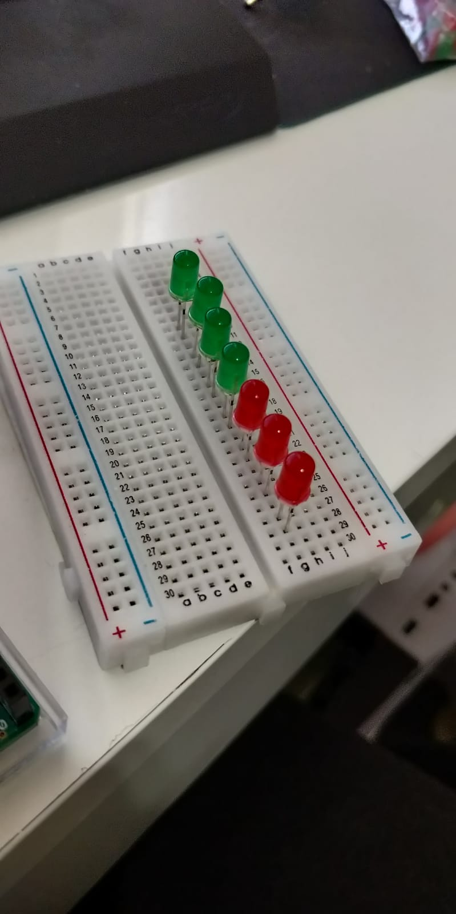
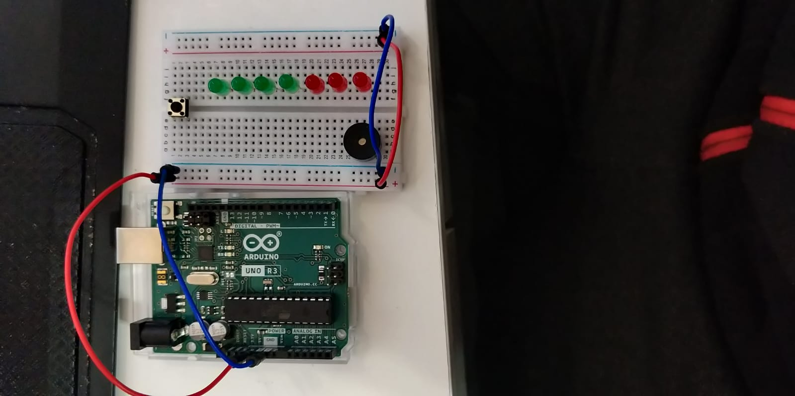
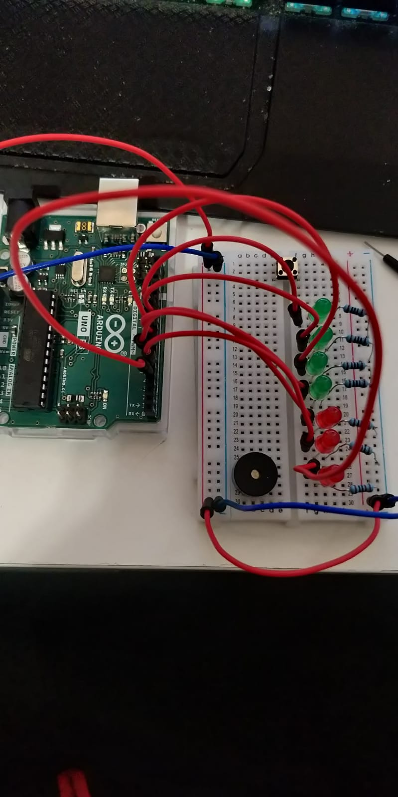
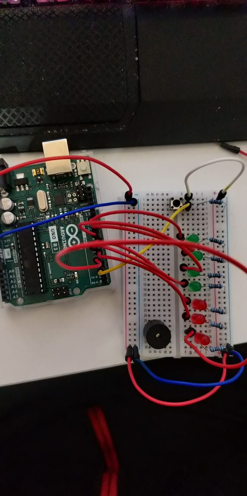
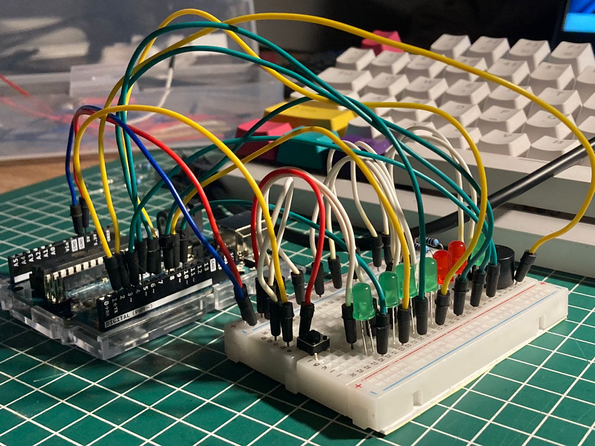
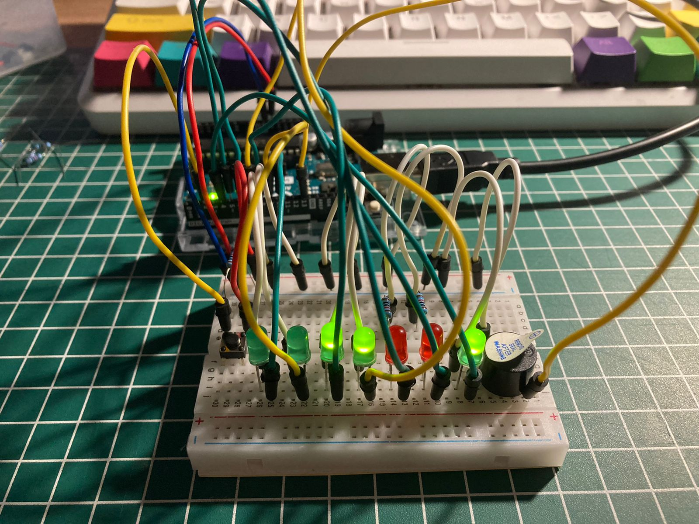

# **Proyecto Final: _Reloj Pomodoro:_** para estudio y productividad

**Trabajando con:** Camila Donoso

# **Lista de materiales:**

Arduino UNO

7 LED de 3mm (5 de color verde y 2 de color rojo)

Buzzer

Botón pulsador

2 resistencias 1 K

Protoboard 

Cables Dupont M/M

# **Introducción**

La gestión efectiva del tiempo es esencial para maximizar la productividad en cualquier actividad, especialmente en el estudio y el trabajo.

Una técnica que se ha vuelto popular y ha demostrado su eficacia es la técnica Pomodoro:

- Esta técnica se basa en la idea de dividir el tiempo en bloques cortos y enfocados, alternando períodos de trabajo intensivo con breves descansos.
- Normalmente es aplicada utilizando 25 minutos de concentracion, 5 minutos de descanso corto y 20 minutos o más en un descanso largo

Entre sus beneficios estan:

- Mejora la concentración
- Incrementa la productividad
- Combate la fatiga mental
- Fomenta la autodisciplina

Para facilitar la implementación de la técnica Pomodoro, se ha desarrollado un reloj especialmente diseñado que te permite llevar un seguimiento preciso de los intervalos de trabajo y descanso.


Tiempo trabajo: 25 min = 1500 s = 1500000 ms

Tiempos descanso corto: 5 min = 298 s = 298000 ms

Tiempo descanso largo: 20 min = 1198 s = 1198000 ms


# **Software**
Arduino IDE

### Codigo utilizado:

```java
// Reloj Pomodoro Adrian Vasquez Camila Donoso
// Entrega Proyecto Final

#define work 0
#define shortBreak 1
#define longBreak 2

int state = work;
int counter = 0;


const int buttonPin = 2;

const int buzzer = 3;                  // Sonido
const int workPeriodLED = 4;           // Periodo de Trabajo
const int shortBreakLED = 5;           // Periodo corto de Descanso
const int longBreakLED  =  6;          // Periodo largo de Descanso

//Indicador de numero de "Pomodoros" terminados 
const int pom1LED =   7;                 
const int pom2LED =   8;
const int pom3LED =   9;
const int pom4LED =   10;

void setup() {

  pinMode(buttonPin, INPUT);
  

  pinMode(buzzer, OUTPUT);
  pinMode(workPeriodLED, OUTPUT);
  pinMode(shortBreakLED, OUTPUT);
  pinMode(longBreakLED, OUTPUT);
  pinMode(pom1LED, OUTPUT);
  pinMode(pom2LED, OUTPUT);
  pinMode(pom3LED, OUTPUT);
  pinMode(pom4LED, OUTPUT);
  while(digitalRead(buttonPin) == 1);    //Espera hasta que se presiona el boton para iniciar el tiempo  
}

void loop() {
  if(state == work){
    workMode(); 
  }
  if(state == shortBreak){
    shortBreakMode();
  }
  if(state == longBreak){
    longBreakMode();
  }
}

void workMode(void){
  pomodoroStatus();
  digitalWrite(workPeriodLED, HIGH);
  digitalWrite(shortBreakLED, LOW);
  digitalWrite(longBreakLED, LOW);
  delay(1500000);          //25 minutos de espera
  counter++;
  if(counter <= 3){
    state = shortBreak;      //Una vez se acaba el tiempo de trabajo se inicia el tiempo de descanso
  }
   
  if(counter == 4){
    state = longBreak;
  }
}

void shortBreakMode(void){
  pomodoroStatus();
  digitalWrite(workPeriodLED, LOW);
  digitalWrite(shortBreakLED, HIGH);
  digitalWrite(longBreakLED, LOW);
  digitalWrite(buzzer, HIGH);
  delay(1000);
  digitalWrite(buzzer, LOW);        
  delay(298000);   //5 Minutos  
  digitalWrite(buzzer, HIGH);
  delay(1000);
  digitalWrite(buzzer, LOW);
  if(counter<=3){
    state = work;
  }

}

void longBreakMode(void){
  pomodoroStatus();
  digitalWrite(workPeriodLED, LOW);
  digitalWrite(shortBreakLED, LOW);
  digitalWrite(longBreakLED, HIGH);
  digitalWrite(buzzer, HIGH);
  delay(1000);
  digitalWrite(buzzer, LOW);
  delay(1198000);     //Alrededor de 20 minutos
  digitalWrite(buzzer, HIGH);
  delay(1000);
  digitalWrite(buzzer, LOW);
  //Enciende las 4 luces led cuando 4 "Pomodoros" hayan sido completados   
  digitalWrite(workPeriodLED, HIGH);
  digitalWrite(shortBreakLED, HIGH);
  digitalWrite(longBreakLED, HIGH);
  while(digitalRead(buttonPin) == 1);  //Una vez que 4 "Pomodoros" hayan sido completados se reiniciara el tiempo cuando se presione el boton 
  //Reinicia todas las variables y se pone en modo trabajo 
  counter = 0;
  state = work;  
  
}

//Representacion del numero de "Pomodoros" 
void pomodoroStatus(void){
  if(counter == 0){
    digitalWrite(pom1LED, LOW);
    digitalWrite(pom2LED, LOW);
    digitalWrite(pom3LED, LOW);
    digitalWrite(pom4LED, LOW);
    
  }
  if(counter == 1){
    digitalWrite(pom1LED, HIGH); 
  }
  if(counter == 2){
    digitalWrite(pom1LED, HIGH);
    digitalWrite(pom2LED, HIGH);
  }
  if(counter == 3){
    digitalWrite(pom1LED, HIGH);
    digitalWrite(pom2LED, HIGH);
    digitalWrite(pom3LED, HIGH);
  }
  if(counter ==4){
    digitalWrite(pom1LED, HIGH);
    digitalWrite(pom2LED, HIGH);
    digitalWrite(pom3LED, HIGH);
    digitalWrite(pom4LED, HIGH);
  }

}
```

# Ensamble 

Al iniciar el reloj primero colocamos las luces en orden 



Luego procedimos a conectar la alimentación del protoboard, el cable a tierra, colocar el boton y poner el altavoz



Procedimos dandole poder a todas las luces y luego conectando el boton




Luego de darle poder a todos los elementos y conectarlos en sus respectivos pines el producto final quedo de esta manera:




La forma de funcionamiento es que cada vez que se conecte el dispositivo se dara inicio al tiempo contando 25 minutos de trabajo para luego cada 25 minutos tomar un descanso de 5 y considerar que se completo 1 "Pomodoro"
Esto continuara de esta manera hasta que se hayan completado 4 pomodoros luego de llegar a esta meta se recompensara al usuario con un descanso de 20 minutos y tendra que presionar el boton para poder reiniciar la cuenta 
de "Pomodoros" y continuar con la productividad 

Aqui una pequeña demostracion de como funciona el dispositivo 


# Referencias

Nos basamos y guiamos por el **Codigo:** https://www.hackster.io/355077/pomodoro-timer-using-arduino-1b353a

Informacion obtenida de: https://aulicum.com/blog/tecnica-pomodoro/


